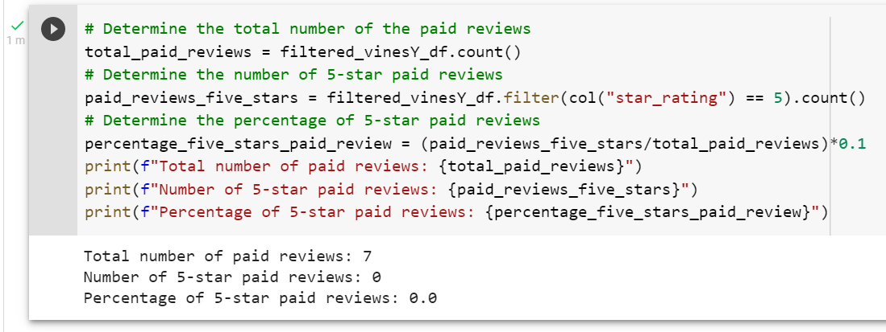
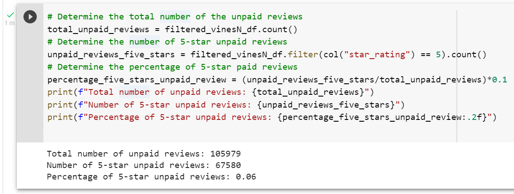

# Amazon Vine Analysis

## Overview
The Amazon Vine program is a service that allows manufacturers and publishers to receive reviews for their products. Companies pay a small fee to Amazon and provide products to Amazon Vine members, who are then required to publish a review. We analyzed the Music reviews dataset to determine if there is any bias towards reviews written as part of the Vine program and if it makes a difference in the percentage of 5-star reviews.

## Resources
  - Development tools: Google Colaboratory
  - Data analytics framework: Apache Spark 3.0.3
  - Programming language: PySpark and Pandas 1.2.4
  - Datasource: Amazon Music reviews (amazon_reviews_us_Music_v1_00.tsv.gz)

## Results
The Amazon Music Reviews dataset has the following schema as the other dataset reviews:

We recreated a vine table by filtering the dataset to retrieve all the rows where the “total_votes” count is equal to or greater than 20 to pick reviews that are more likely to be helpful and to avoid having division by zero errors and the number of “helpful_votes” divided by “total_votes” is equal to or greater than 50%

To determine if there is any bias towards reviews that were written as part of the Vine program, we filtered the dataset to calculate the total number, the number of 5-star, and the percentage of 5-star reviews for the two types: paid and unpaid, getting the following results.

- Music paid reviews

- Music unpaid reviews

## Summary
The analysis outcome showcase there is not any positivity bias for the music reviews in the Vine program due to the number of paid reviews population representing 0.007 % of the filtered dataset. However, the unpaid reviews have almost 60% with a 5-star rating.

To support

